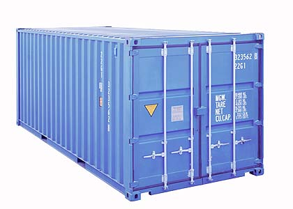

Vagrant & Docker
================

Ou *carregue seus ambientes no bolso* com Vagrant e Docker

[diogo.lucas@gmail.com](mailto:diogo.lucas@gmail.com)


---


Primeiro, o bode na sala:


----


##*dokku*


----


* *Servidor dokku*
* *Scripts dokku*
* *Deployment dokku*
* *Sugestões dokku?*


----


voltaremos ~~aokku~~ ao dokku mais tarde


---


----

Ambientes:

a) reprodutíveis

b) portáveis


----


like so (demo)


----


sim, o fluxo se resume a:

```shell
$ git clone my-repo
$ vagrant up
```


----


olhando por baixo dos panos...


----


### Anatomia de um arquivo Vagrant (sim, isso é Ruby :)):
```ruby
# (...)
VAGRANTFILE_API_VERSION = "2"

Vagrant.configure(VAGRANTFILE_API_VERSION) do |config|
  # Aqui configuramos o base box -- a imagem de base para a criação da VM
  config.vm.box = "cbumgard/nodejs"

  # Configurando port forwarding do host para a VM
  config.vm.network "forwarded_port", guest: 1954, host: 1954

  # Exemplo de configuração de um IP fixo (interno) para a VM
  # config.vm.network "private_network", ip: "192.168.33.10"

  # Exemplo de um shared folder -- pastas compartilhadas entre o host e a VM
  # config.vm.synced_folder "../data", "/vagrant_data"
end
```

----


Ok, mas e se suas *aplicações* fossem portáteis?

---


----


### Problemão de logÍstica até 1950:
Como transportar e cobrar por cargas tão diferentes entre si?


----


### A solução:



----


### Problemão de devops até 2013:
Como deployar e promover aplicações tão diferentes entre si?

----


### A solução:

Note: this page intentionally left blank (not!)


----


### Um exemplo com MongoDb

```shell
$ docker run --name exemplo-TDC -d mongo
$ docker run -it --link exemplo-TDC:mongo \
	--rm mongo sh -c 'exec mongo \
	"$MONGO_PORT_27017_TCP_ADDR:$MONGO_PORT_27017_TCP_PORT/test"'
$ show dbs
```

----


### Conceitos:
* Um *container* é uma unidade de execução
* Uma *imagem* é a base para um container
* Uma *dockerfile* é uma especificação para a criação de imagens docker


----

### Por que um dev gosta disso?

Portabilidade + Reprodutibilidade

----------------------------

Ei, não dependo de burocratas todo o tempo!

----


### Por que um devops gosta disso?

Automação + Reprodutibilidade

-----------------------------

Ei, é menos trabalho chato!

----


### Por que um admin gosta disso?

Ei, é menos trabalho!


----


### Por que um infra manager gosta disso?

~~Ei, é uma melhor densidade computacional!~~

Ei, posso gastar menos!


---


Mas esperem, tem mais!
======================


----


Docker + Heroku 

---------------------------------------------------

Dokku

----

Docker + Vagrant

---------------------------------------------------

Ambientes locais e hosted iguaizinhos!

----


Docker-based promotions
-----------------------

* Build: docker push
* Deploy: docker pull


----


Docker Extras
-------------

* MesoSphere
* Kubernetes
* OpenShift
* Flynn
* Deis
* Fig

---


Q&A
===


----


### O incrédulo: Ok, mas quais são os problemas com o Docker?

----


1. Alto no hype cycle
2. Preocupações sobre segurança e estabilidade
3. Rampa de equipe
4. Use cases parciais


----

### O experiente: Tá, mas e porque eu não posso usar só Puppet & afins?

Poder, pode, mas não vai ser a mesma coisa:

a) menor reprodutibilidade e 
b) menor densidade potencial

----

### O empolgado: Legal, legal, muito legal! Onde eu assino?!?

1. [Crie seu próprio sandbox](https://github.com/phusion/open-vagrant-boxes)
2. [Ouça a própria Docker](http://www.youtube.com/user/dockerrun)
3. [Entre na IASA/GUCloud (nudge nudge)](http://www.linkedin.com/groups/GU-Cloud-Computing-Porto-Alegre-5018296) 


